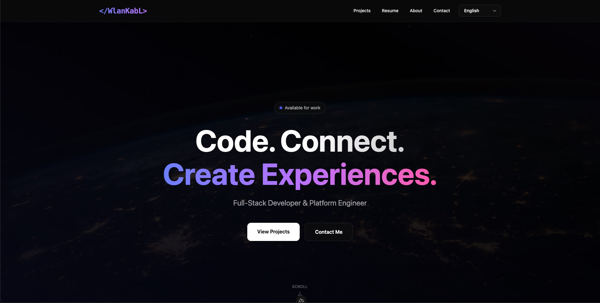

# WlanKabL Portfolio

> A modern, high-performance portfolio built with precision and attention to detail.

[](https://wlankabl.com)

**Live Demo:** [wlankabl.com](https://wlankabl.com)

---

## Design Philosophy

A clean, minimalist portfolio focused on performance and user experience. Every animation, transition, and visual effect is crafted to feel premium and professional.

### Core Design Principles:

- **Pure Black Theme** (`#000000`) – True depth and contrast
- **Glassmorphism** – Subtle backdrop blur effects with transparency
- **Smooth Animations** – Staggered fade-ins, scale effects, gradient shifts
- **Typography Excellence** – Carefully balanced hierarchy and spacing
- **Responsive Perfection** – Flawless experience from mobile to 4K displays

Built for speed, clarity, and impact.

---

## Features

### Core Functionality

- **Fully Responsive Design** – Optimized for all devices and screen sizes
- **Multilingual Support** – i18n ready (DE, EN, NL)
- **Contact Form** – Integrated Discord Webhook for instant notifications
- **Project Showcase** – Detailed project pages with rich metadata
- **SEO Optimized** – Meta tags, OpenGraph, and semantic HTML

### Visual Excellence

- **Custom Animation System** – 4 keyframe animations (fade-in-up, scale-in, slide-in-right, gradient-shift)
- **Glassmorphism UI** – Backdrop blur effects throughout
- **Interactive Components** – Hover effects, smooth transitions, micro-animations
- **Gradient Accents** – Subtle color gradients for visual interest
- **Custom Scrollbar** – Styled for consistency across browsers

### Performance & DX

- **TypeScript First** – Strict typing, full autocomplete
- **Modular Architecture** – Composables, services, clean separation
- **Docker Ready** – Production-optimized containerization
- **Zero Config** – Works out of the box

---

## Getting Started

### Prerequisites

- Node.js 18+ or 20+
- npm or pnpm

### Quick Start

```bash
# 1. Clone the repository
git clone https://github.com/WlanKabL/portfolio.git
cd portfolio

# 2. Install dependencies
npm install

# 3. Create environment file
cp .env.example .env
# Edit .env and add your Discord Webhook URL

# 4. Start development server
npm run dev
```

Visit **http://localhost:3000** to see your portfolio in action.

### Available Scripts

| Command             | Description                       |
| ------------------- | --------------------------------- |
| `npm run dev`       | Start development server with HMR |
| `npm run build`     | Build for production              |
| `npm run preview`   | Preview production build locally  |
| `npm run generate`  | Generate static site (SSG)        |
| `npm run lint`      | Run ESLint                        |
| `npm run typecheck` | Type-check TypeScript files       |

### Environment Variables

Create a `.env` file in the root directory:

```env
# Discord Webhook for Contact Form
DISCORD_WEBHOOK_URL=https://discord.com/api/webhooks/YOUR_WEBHOOK_ID/YOUR_WEBHOOK_TOKEN

# Optional: Custom Port
PORT=3000
```

---

## Docker Deployment

This project is fully dockerized and ready for production.

### 1. Build Docker Image

Use Docker Compose (recommended for more control):

### `docker-compose.yml`

```yaml
services:
    portfolio:
        build: .
        ports:
            - "3000:3000"
        env_file:
            - .env
        restart: unless-stopped
```

Then run:

```bash
docker-compose up -d (--build)
```

---

## Tech Stack

| Category       | Technology       | Purpose                                     |
| -------------- | ---------------- | ------------------------------------------- |
| **Framework**  | Nuxt 3           | Vue 3 SSR framework with file-based routing |
| **Language**   | TypeScript       | Strict typing, enhanced DX                  |
| **Styling**    | Tailwind CSS 4.0 | Utility-first CSS with custom animations    |
| **State**      | VueUse           | Composable utilities (`useCloned`, etc.)    |
| **Icons**      | Lucide Icons     | Clean, modern SVG icon library              |
| **i18n**       | @nuxtjs/i18n     | Multi-language support (DE/EN/NL)           |
| **Build**      | Vite             | Lightning-fast HMR and optimized builds     |
| **Deployment** | Docker           | Containerized production environment        |

### Custom Design System

```typescript
// Animations
- fade-in-up      → Smooth entrance from bottom
- scale-in        → Zoom effect for cards
- slide-in-right  → Horizontal slide for lists
- gradient-shift  → Animated gradient borders

// Glassmorphism
.glass {
  backdrop-filter: blur(12px);
  background: rgba(255, 255, 255, 0.05);
  border: 1px solid rgba(255, 255, 255, 0.1);
}
```

---

## Project Structure

```
portfolio/
├── 📁 assets/             # Global styles & assets
│   └── tailwind.css       # Custom animations & utilities
│
├── 📁 components/         # Vue components (17 total)
│   ├── NavBar.vue         # Gradient logo, animated menu
│   ├── LandingPage.vue    # Hero with availability badge
│   ├── AboutMe.vue        # Animated portrait, glass cards
│   ├── TechStack.vue      # Tech stack showcase
│   ├── ContactForm.vue    # Discord-integrated form
│   ├── ProjectCardCompact.vue
│   ├── ProjectCardDetailed.vue
│   └── PageFooter.vue
│
├── 📁 composables/        # Reusable logic
│   └── useProjects.ts     # Project data management
│
├── 📁 data/               # Static data
│   ├── projects.ts        # Project metadata & descriptions
│   └── techStacks.ts      # Technology stack definitions
│
├── 📁 i18n/               # Internationalization
│   ├── i18n.config.ts     # i18n configuration
│   └── locales/           # Translation files (de, en, nl)
│
├── 📁 pages/              # File-based routing
│   ├── index.vue          # Homepage
│   ├── about.vue          # About page
│   ├── contact.vue        # Contact page
│   ├── resume.vue         # Resume/CV
│   └── projects/          # Project pages
│       ├── index.vue      # Project overview
│       └── [slug].vue     # Dynamic project detail
│
├── 📁 server/             # Backend API
│   └── api/
│       └── contact.ts     # Discord webhook handler
│
├── 📁 public/             # Static assets
│   ├── preview.png        # Portfolio preview screenshot
│   └── ...                # Project images, logos, etc.
│
├── 📁 types/              # TypeScript definitions
│   └── projects.ts        # Project type definitions
│
├── nuxt.config.ts         # Nuxt configuration
├── tailwind.config.js     # Tailwind configuration
├── tsconfig.json          # TypeScript configuration
├── Dockerfile             # Docker container config
└── docker-compose.yml     # Docker Compose setup
```

---

## Contact Form Integration

The contact form sends submissions directly to Discord via webhooks:

1. **User fills form** → Email + Message
2. **Form validates** → Client-side validation
3. **API endpoint** → `server/api/contact.ts` processes request
4. **Discord notification** → Instant message in your Discord channel

Perfect for quick responses without email clutter.

---

## Key Components

### LandingPage

- **Hero Section** with availability badge
- **Staggered Animations** (0.6s - 1.2s delays)
- **Scroll Indicator** with bounce animation
- **Gradient Text Effects** for emphasis

### TechStack

- **Glassmorphism Cards** with hover effects
- **Shine Effect** on card hover
- **Scroll Indicators** for horizontal scrolling
- **Animated Icons** with scale transitions

### ContactForm

- **Modern Input Fields** with focus glows
- **Gradient Submit Button** with hover scale
- **Animated Feedback** (success/error messages)
- **Discord Integration** via webhook

### ProjectCards

- **Compact & Detailed Views**
- **Glass Design** with backdrop blur
- **Image Overlay** effects on hover
- **Staggered Tag Animations**

---

## Screenshots

| Page     | Preview                           |
| -------- | --------------------------------- |
| Homepage |  |
| Projects | _Coming soon..._                  |
| About    | _Coming soon..._                  |
| Contact  | _Coming soon..._                  |

> **Note:** Additional screenshots can be added to showcase individual sections!

---

## Deployment

### Docker Deployment (Recommended)

```bash
# Build and run with Docker Compose
docker-compose up -d --build

# Check logs
docker-compose logs -f

# Stop container
docker-compose down
```

**docker-compose.yml:**

```yaml
services:
    portfolio:
        build: .
        ports:
            - "3000:3000"
        env_file:
            - .env
        restart: unless-stopped
```

### Manual Production Build

```bash
# Build for production
npm run build

# Preview production build
npm run preview
```

---

## Customization

### Adding New Projects

Edit `data/projects.ts`:

```typescript
export const projects: Project[] = [
    {
        title: "Your Project",
        slug: "your-project",
        description: { en: "Description..." },
        technologies: ["Vue", "TypeScript"],
        // ... more fields
    },
];
```

### Changing Colors

Edit `tailwind.config.js` for theme customization:

```javascript
theme: {
    extend: {
        colors: {
            // Add your custom colors
        }
    }
}
```

### Adding Translations

Add keys to `i18n/locales/{de,en,nl}.json`:

```json
{
    "your_key": "Translation text"
}
```

---

## Roadmap

- [ ] Blog integration (MDX/CMS)
- [ ] Admin panel for project management
- [ ] GitHub Actions CI/CD pipeline
- [ ] Performance analytics dashboard
- [ ] Extended animation library
- [ ] Dark/Light mode toggle (currently pure black)
- [ ] More screenshot sections

---

## Performance

- **Lighthouse Score:** 95+ (Performance, Accessibility, Best Practices)
- **Build Time:** ~15-20 seconds (optimized)
- **Bundle Size:** Minimal (code-splitting enabled)
- **First Contentful Paint:** < 1s on fast connections
- **Smooth 60fps** animations across all interactions

---

## Author

**WlanKabL**  
Full-Stack Developer & Creative Builder

Built with love, passion, and way too much caffeine.

- [wlankabl.com](https://wlankabl.com/)
- [LinkedIn](https://www.linkedin.com/in/wlankabl/)
- [GitHub](https://github.com/WlanKabL)

---

## Contributing

This is a personal portfolio, but suggestions and feedback are always welcome!

1. Fork the project
2. Create your feature branch (`git checkout -b feature/AmazingFeature`)
3. Commit your changes (`git commit -m 'feat: add some amazing feature'`)
4. Push to the branch (`git push origin feature/AmazingFeature`)
5. Open a Pull Request

---

## License

**MIT License** – Free to use, adapt, and learn from.

> **Credit appreciated & required** when using significant portions of the design system or component architecture.

---

## Acknowledgments

- **Nuxt Team** – For the amazing framework
- **Tailwind Labs** – For the utility-first CSS approach
- **Lucide** – For the beautiful icon library
- **Vue Community** – For continuous innovation

---

<div align="center">

**Made with passion by WlanKabL**

If this portfolio inspired you, consider giving it a star.

</div>
