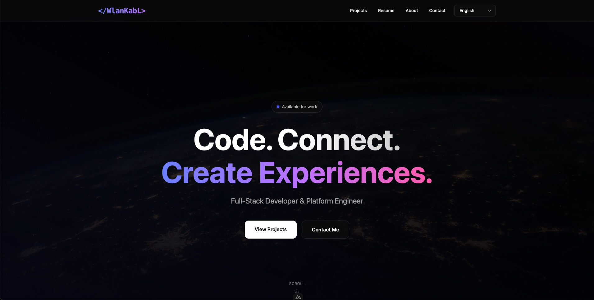

# WlanKabL Portfolio

> A modern, high-performance portfolio built with precision and attention to detail.

[](https://wlankabl.com)

**Live Demo:** [wlankabl.com](https://wlankabl.com)

---

## Design Philosophy

An "Engineered Studio" design system: this is not a developer portfolio, it's the site of a
product builder. A cool technical off-white canvas keeps the studio professional and approachable,
while every product keeps its **own brand world** — dark showcase panels in the product's own
color (ZentraX purple, KeeperLog green, Conformity Gate red).

### Core Design Principles:

- **Technical Off-White Canvas** (`#f4f3f0`) – Light and business-ready, never paper-romantic
- **Violet & Yellow** – Violet (`#6d28d9`) as the personal brand color, yellow (`#fdd23a`) as the
  complementary eye-catcher: CTAs with hard offset shadows, highlighter swipes, stickers
- **Products Keep Their Brands** – Each product uses its own colors via `--brand` /
  `--project-accent` CSS variables
- **Asymmetry & Character** – Staggered card columns, rotated polaroid & stickers, hairline
  accents that grow on hover — composed, not grid-templated
- **Tech Typography** – Bricolage Grotesque display, Archivo body, IBM Plex Mono for labels,
  indices and metrics (the dev DNA)
- **Intentional Motion** – Choreographed hero entrance, scroll reveals via IntersectionObserver,
  full `prefers-reduced-motion` support

Built for speed, clarity, and impact.

---

## Features

### Core Functionality

- **Fully Responsive Design** – Optimized for all devices and screen sizes
- **Multilingual Support** – i18n ready (DE, EN, NL)
- **Contact Form** – Integrated Discord Webhook for instant notifications
- **Project Showcase** – Detailed project pages with rich metadata
- **SEO Optimized** – Meta tags, OpenGraph, and semantic HTML

### Visual Excellence

- **Scroll Reveal System** – `v-reveal` directive with stagger support and reduced-motion fallback
- **Choreographed Hero** – Masked line reveals plus a metrics strip with real numbers
- **Brand Panels** – Each product showcased in its own dark brand world with logo plate and glow
- **Per-Product Accents** – Project cards and case-study pages inherit the product's brand color
- **Blueprint Grid** – Subtle engineering texture on light sections
- **Custom Scrollbar** – Styled for consistency across browsers

### Performance & DX

- **TypeScript First** – Strict typing, full autocomplete
- **Modular Architecture** – Composables, services, clean separation
- **Docker Ready** – Production-optimized containerization
- **Zero Config** – Works out of the box

---

## Getting Started

### Prerequisites

- Node.js 18+ or 20+
- npm or pnpm

### Quick Start

```bash
# 1. Clone the repository
git clone https://github.com/WlanKabL/portfolio.git
cd portfolio

# 2. Install dependencies
npm install

# 3. Create environment file
cp .env.example .env
# Edit .env and add your Discord Webhook URL

# 4. Start development server
npm run dev
```

Visit **http://localhost:3000** to see your portfolio in action.

### Available Scripts

| Command             | Description                       |
| ------------------- | --------------------------------- |
| `npm run dev`       | Start development server with HMR |
| `npm run build`     | Build for production              |
| `npm run preview`   | Preview production build locally  |
| `npm run generate`  | Generate static site (SSG)        |
| `npm run lint`      | Run ESLint                        |
| `npm run typecheck` | Type-check TypeScript files       |

### Environment Variables

Create a `.env` file in the root directory:

```env
# Discord Webhook for Contact Form
DISCORD_WEBHOOK_URL=https://discord.com/api/webhooks/YOUR_WEBHOOK_ID/YOUR_WEBHOOK_TOKEN

# Optional: Custom Port
PORT=3000
```

---

## Docker Deployment

This project is fully dockerized and ready for production.

### 1. Build Docker Image

Use Docker Compose (recommended for more control):

### `docker-compose.yml`

```yaml
services:
    portfolio:
        build: .
        ports:
            - "3000:3000"
        env_file:
            - .env
        restart: unless-stopped
```

Then run:

```bash
docker-compose up -d (--build)
```

---

## Tech Stack

| Category       | Technology       | Purpose                                     |
| -------------- | ---------------- | ------------------------------------------- |
| **Framework**  | Nuxt 3           | Vue 3 SSR framework with file-based routing |
| **Language**   | TypeScript       | Strict typing, enhanced DX                  |
| **Styling**    | Tailwind CSS 4.0 | Utility-first CSS with custom animations    |
| **State**      | VueUse           | Composable utilities (`useCloned`, etc.)    |
| **Icons**      | Lucide Icons     | Clean, modern SVG icon library              |
| **i18n**       | @nuxtjs/i18n     | Multi-language support (DE/EN/NL)           |
| **Build**      | Vite             | Lightning-fast HMR and optimized builds     |
| **Deployment** | Docker           | Containerized production environment        |

### Custom Design System

```css
/* Tokens (assets/tailwind.css, Tailwind 4 @theme) */
--color-bg: #f4f3f0; /* technical off-white canvas */
--color-ink: #181317; /* deep ink text */
--color-accent: #6d28d9; /* violet — the personal brand color */
--color-highlight: #fdd23a; /* yellow — the eye-catcher (CTAs, markers) */
--font-display: "Bricolage Grotesque"; /* characterful tech display */
--font-sans: "Archivo"; /* body & UI */
--font-mono: "IBM Plex Mono"; /* labels, indices, metrics */
```

```typescript
// Brand system
- data/projects.ts   → each product defines brand: { color, panel }
- --brand            → drives panel accents, card hovers, CTAs
- --project-accent   → recolors case-study articles per product

// Motion
- rise-up            → Masked line reveal for the hero headline
- [data-reveal]      → Scroll-triggered reveals via the v-reveal directive
```

---

## Project Structure

```
portfolio/
├── 📁 assets/             # Global styles & assets
│   └── tailwind.css       # Custom animations & utilities
│
├── 📁 components/         # Vue components
│   ├── NavBar.vue         # WlanKabL Digital brand, animated links
│   ├── LandingPage.vue    # Choreographed hero with metrics strip
│   ├── ProductShowcase.vue # Brand panels — each product in its own world
│   ├── ServicesSection.vue # "What I build for you" offer
│   ├── ProjectCardModern.vue # Gallery card with per-product brand accent
│   ├── SectionHeading.vue # Numbered section headings
│   ├── AboutMe.vue        # Portrait & founder story
│   ├── TechStack.vue      # Definition-list stack overview
│   ├── ContactForm.vue    # Discord-integrated line-input form
│   └── PageFooter.vue     # Dark footer with big CTA
│
├── 📁 composables/        # Reusable logic
│   └── useProjects.ts     # Project data management
│
├── 📁 plugins/            # Nuxt plugins
│   ├── reveal.ts          # v-reveal scroll animation directive
│   └── locale-domain.ts   # .de domain defaults to German
│
├── 📁 data/               # Static data
│   ├── projects.ts        # Project metadata & descriptions
│   └── techStacks.ts      # Technology stack definitions
│
├── 📁 i18n/               # Internationalization
│   ├── i18n.config.ts     # i18n configuration
│   └── locales/           # Translation files (de, en, nl)
│
├── 📁 pages/              # File-based routing
│   ├── index.vue          # Homepage
│   ├── about.vue          # About page
│   ├── contact.vue        # Contact page
│   ├── resume.vue         # Resume/CV
│   └── projects/          # Project pages
│       ├── index.vue      # Project overview
│       └── [slug].vue     # Dynamic project detail
│
├── 📁 server/             # Backend API
│   └── api/
│       └── contact.ts     # Discord webhook handler
│
├── 📁 public/             # Static assets
│   ├── preview.png        # Portfolio preview screenshot
│   └── ...                # Project images, logos, etc.
│
├── 📁 types/              # TypeScript definitions
│   └── projects.ts        # Project type definitions
│
├── nuxt.config.ts         # Nuxt configuration
├── tailwind.config.js     # Tailwind configuration
├── tsconfig.json          # TypeScript configuration
├── Dockerfile             # Docker container config
└── docker-compose.yml     # Docker Compose setup
```

---

## Contact Form Integration

The contact form sends submissions directly to Discord via webhooks:

1. **User fills form** → Email + Message
2. **Form validates** → Client-side validation
3. **API endpoint** → `server/api/contact.ts` processes request
4. **Discord notification** → Instant message in your Discord channel

Perfect for quick responses without email clutter.

---

## Key Components

### LandingPage

- **Masked Line Reveals** – Headline lines rise out of overflow masks, key phrase gets a
  yellow highlighter swipe
- **Entrepreneur Positioning** – "I build digital products. My own — and yours."
- **Polaroid & Stickers** – Rotated portrait with tape, floating personality chips and a
  yellow badge — asymmetric on purpose
- **Metrics Row** – Real numbers: live products, automated tests, solo full stack

### ProductShowcase

- **Brand Panels** – Each product gets a dark panel in its own brand color with logo plate
- **Brand Glow** – Soft color bloom that intensifies on hover
- **Scroll Reveals** – Each panel animates in via `v-reveal`

### ServicesSection

- **Clear Offer** – Web apps & SaaS MVPs, automation & integrations, platforms & infrastructure
- **Conversion CTA** – "Start a project" leading straight to contact

### ContactForm

- **Line Inputs** – Minimal underline fields with numbered mono labels
- **Status Feedback** – `[ok]` / `[error]` messages
- **Discord Integration** via webhook

---

## Screenshots

| Page     | Preview                           |
| -------- | --------------------------------- |
| Homepage |  |
| Projects | _Coming soon..._                  |
| About    | _Coming soon..._                  |
| Contact  | _Coming soon..._                  |

> **Note:** Additional screenshots can be added to showcase individual sections!

---

## Deployment

### Docker Deployment (Recommended)

```bash
# Build and run with Docker Compose
docker-compose up -d --build

# Check logs
docker-compose logs -f

# Stop container
docker-compose down
```

**docker-compose.yml:**

```yaml
services:
    portfolio:
        build: .
        ports:
            - "3000:3000"
        env_file:
            - .env
        restart: unless-stopped
```

### Manual Production Build

```bash
# Build for production
npm run build

# Preview production build
npm run preview
```

---

## Customization

### Adding New Projects

Edit `data/projects.ts`:

```typescript
export const projects: Project[] = [
    {
        title: "Your Project",
        slug: "your-project",
        description: { en: "Description..." },
        technologies: ["Vue", "TypeScript"],
        // ... more fields
    },
];
```

### Changing Colors

Edit `tailwind.config.js` for theme customization:

```javascript
theme: {
    extend: {
        colors: {
            // Add your custom colors
        }
    }
}
```

### Adding Translations

Add keys to `i18n/locales/{de,en,nl}.json`:

```json
{
    "your_key": "Translation text"
}
```

---

## Roadmap

- [ ] Blog integration (MDX/CMS)
- [ ] Admin panel for project management
- [ ] GitHub Actions CI/CD pipeline
- [ ] Performance analytics dashboard
- [ ] Extended animation library
- [ ] Dark/Light mode toggle (currently pure black)
- [ ] More screenshot sections

---

## Performance

- **Lighthouse Score:** 95+ (Performance, Accessibility, Best Practices)
- **Build Time:** ~15-20 seconds (optimized)
- **Bundle Size:** Minimal (code-splitting enabled)
- **First Contentful Paint:** < 1s on fast connections
- **Smooth 60fps** animations across all interactions

---

## Author

**WlanKabL**  
Full-Stack Developer & Creative Builder

Built with love, passion, and way too much caffeine.

- [wlankabl.com](https://wlankabl.com/)
- [LinkedIn](https://www.linkedin.com/in/wlankabl/)
- [GitHub](https://github.com/WlanKabL)

---

## Contributing

This is a personal portfolio, but suggestions and feedback are always welcome!

1. Fork the project
2. Create your feature branch (`git checkout -b feature/AmazingFeature`)
3. Commit your changes (`git commit -m 'feat: add some amazing feature'`)
4. Push to the branch (`git push origin feature/AmazingFeature`)
5. Open a Pull Request

---

## License

**MIT License** – Free to use, adapt, and learn from.

> **Credit appreciated & required** when using significant portions of the design system or component architecture.

---

## Acknowledgments

- **Nuxt Team** – For the amazing framework
- **Tailwind Labs** – For the utility-first CSS approach
- **Lucide** – For the beautiful icon library
- **Vue Community** – For continuous innovation

---

<div align="center">

**Made with passion by WlanKabL**

If this portfolio inspired you, consider giving it a star.

</div>
